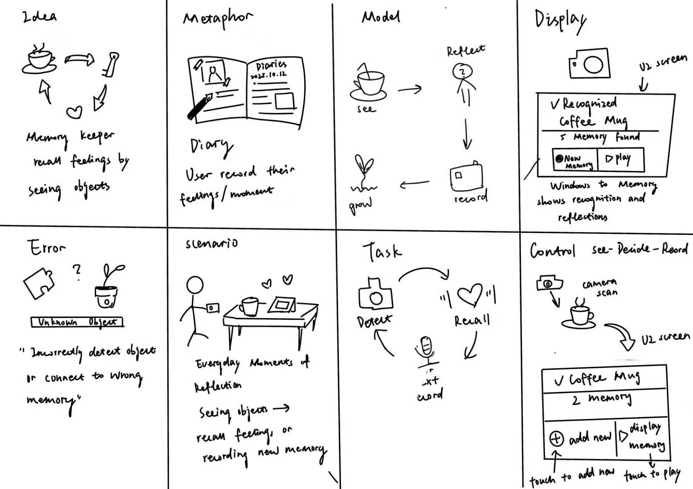
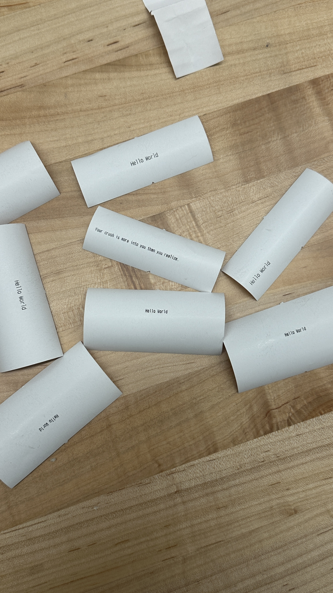
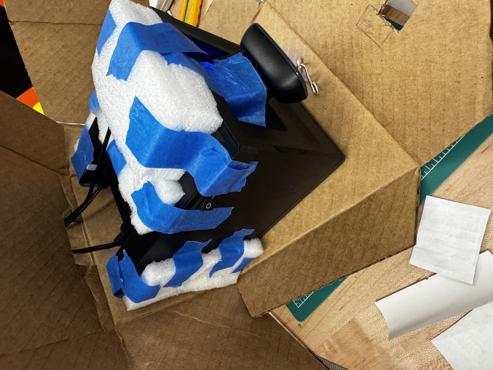
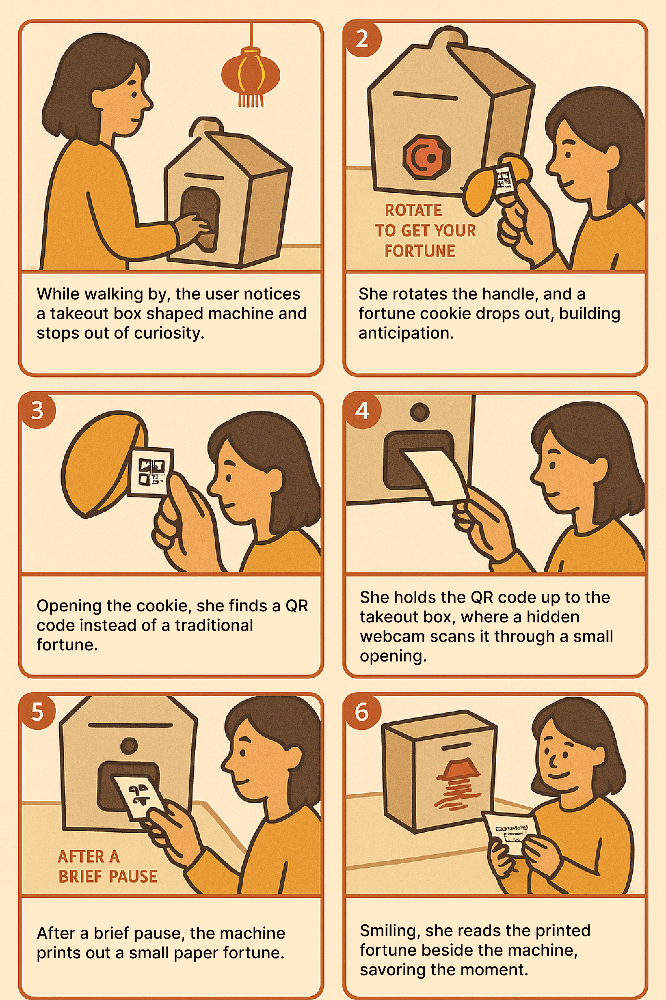

# Digital Fortune Cookie
This project was done by **Jully Li (hl2568), Weicong Hong (wh528), Feier Su (fs495), Sirui Wang (sw2449)** in collaboration.

[Project Plan](#project-plan) 

[Functioning Project](#functioning-project) 

[Documentation of Design Process](#documentation-of-design-process) 

[Archive of All Code and Design Patterns](#archive-of-all-code-and-design-patterns) 

[Video Demo](#video-demo) 

[Reflections on Process](#reflections-on-process) 

[Group Work Distribution](#group-work-distribution)

<strong>Previous Object Journal Dock Idea (click to expand)</strong>

#### Object Journal Dock — Tangible Memory Device
**What We’re Building**
- An RFID-based interactive device that recognizes physical objects. When an object is placed on the dock, the device displays past journals or recorded feelings linked to it.
- Users can add new voice or text entries, creating a tangible memory system that connects emotions to objects.
- *Note:* We will first prototype the system using **NFC** instead of RFID, since the TA is providing an NFC kit, and then transition to RFID only if needed.

**Fall-back Plan**
The project can pivot to use a QR code-based recognition system. Generate Unique QR code for each object using existing python library and decode them via camera. 

### Parts Needed
- Raspberry Pi
- Adafruit Mini PiTFT
- USB Camera with Microphone
- SparkFun Qwiic Joystick
- SparkFun Qwiic Red and Green Buttons
- RFID Reader
- RFID Tags

**NOTE:** We pivoted our project from the <u>Object Journal Dock</u> to the <u>Digital Fortune Cookie Installation</u>, but the core interaction concept remains the same: a physical trigger (previously RFID-tagged objects, now QR-coded capsules) links to digital content, which users can view and contribute to over time. The system still creates an evolving timeline of messages, preserving the idea of shared, persistent interaction, while shifting from personal journaling to a playful, communal experience.

## Project Plan
### Project Motivation

   
  <em>generated by ChatGPT 5.2</em>

The project is inspired by traditional Chinese cultural practices around symbolic rituals, luck, and small acts of fortune-telling. Practices such as drawing lots, opening fortune slips, and engaging with chance-based objects have long been used as playful yet meaningful ways to reflect and make wishes. 

Fortune cookies themselves became widely known through their presence in Western culture, particularly in Chinese restaurants, they carry a shared association with anticipation and chance. We wanted to reinterpret this familiar ritual in a contemporary interactive form.

By designing a physical interaction: rotating a vending machine, receiving a cookie, opening it, scanning a QR code, and watching a message print instantly, the project emphasizes clarity, immediacy, and tangible feedback. Using a Raspberry Pi, camera and a thermal printer, the system transforms a simple, traditional action into a responsive digital–physical loop. 

### Big Idea
The installation creates a shared, communal experience rooted in chance, ritual, and connection. Through the simple act of drawing a fortune cookie, visitors encounter words written by members of the Cornell Tech community for one another. Small offerings of hope, humor, reflection, and care. Each interaction becomes a quiet exchange between strangers, where a familiar gesture unfolds into a moment of connection.

**What We’re Building**
- An interactive installation where visitors rotate a vending machine to receive a physical fortune cookie capsule containing a unique QR code.
- After opening the capsule, visitors scan the QR code using the device.
- The scan triggers the system to automatically retrieve the corresponding fortune.
- A Raspberry Pi controls an external screen for code scanning and a thermal printer that instantly prints out the fortune.

**Fall-back Plan**
If network or QR scanning reliability becomes an issue, we will pivot to:
- A single QR code linking to a random message generator
- Local-only Pi operation where users interact directly through the Pi camera or on-screen input without phone integration.

### Timeline

**November 15** - Finalize device concept & define recognition logic, user flow: Decide detection approach and explore recognition logic

**November 30** - Implement QR generator; build backend structure; create initial Pi display mockup; 3D Printing of Physical Fortune Cookie; Design Fortune Cookie Capsule Vending Machine.

**December 1** - Functional check-off: Fully working demo: object recognized, initial message displayed, new entries recordable

**December 3** - End-to-end working prototype: Get capsule → scan → read → reply → Pi updates

**December 8** - Final Presentation: Organize everything into a coherent presentation; complete README

**December 15** - Write-up and documentation

### Parts Needed
- Raspberry Pi
- External Monitor
- USB Camera with Microphone
- Physical Capsules / Fortune Cookie Holders
- Printed Unique QR Codes
- Phones (Scanning the QR Codes)

## Functioning Project
### 1. Wiring Set-up
@sirui

### 2. Major Components
#### Fortune Cookie Capsule
Each cookie contains a unique QR Code generated randomly by using the website (https://randomqr.com/)

@sirui how each QR code links to the fortune quote

We prepared **56 unique QR codes** and printed them on paper. A black background was intentionally chosen because, through testing, we found that darker backgrounds significantly improve the efficiency and accuracy of camera-based QR code scanning. The printed codes were then cut and folded to fit inside the fortune cookie capsules.

   
  <em>QR Codes on the black background</em>

#### Capsule Vending Machine
We followed the instruction from this tutorial (https://www.youtube.com/shorts/n1d6INIUhoI) to build the internal structure of our capsule vending system.

@Sophie Internal Structure

We used pins to control and guide the capsule’s dropping path inside the vending box. This would guide the capsule to drop at the designated area at the exit. 

   
  <em>Capsule Dropping Path</em>

This is what the final capsule vending machine looks like externally, featuring a rotating knob and a capsule exit. We also added labels to the box to guide users through the process of retrieving a fortune cookie.

Interaction Flow:
1. The user rotates the knob.
2. A capsule drops from the top of the machine to the exit at the bottom.
3. The user picks up the capsule from the exit, which triggers the **sensor** installed at the exit.

(@Sirui explain what's the sensor, and how sensor being triggered here).

   
  <em>Final Capsule Vending Machine</em>

#### Thermal Printer 
The last step of the device interaction is the fortune quote being printed out by scanning the QR code inside the capsule using a USB camera. 

@sirui how thermal printer and camera connected to the whole system. Technical perspective how does it work. QR Code triggering receipt printing out...

We conducted printing tests before placing the printer inside the enclosure.

  

  <em>Printing Test</em>

   
  <em>Printed Sample Fortune Quotes</em>

We secured the printer and USB camera inside the enclosure, with pre-cut holes for wiring.

   
  <em>Secure the printer and USB camera inside the box</em>

Final thermal printer setup with pre-cut holes for printing fortune quotes.

   
  <em>Final Printer Set-up Inside Enclosure</em>

### 3. Final Set-up

   
  <em>Final Set-up</em>

## Documentation of Design Process
### Storyboard

   
  <em>3D Printing Fortune Cookies</em>

### Physical Enclosures
Two major components were used for our final installation. Fortune Cookie which were served as 

#### Fortune Cookies

   
  <em>3D Printing Fortune Cookies</em>

   
  <em>Fortune Cookies</em>

#### Chinese Takeout Box

   
  <em>Laser Cutting Process</em>

   
  <em>Takeout Box Cutout Process</em>

   
  <em>Takeout Box Design</em>

   
  <em>Folded, Draw with patterns</em>

## Archive of All Code and Design Patterns
### All Related Code

@Sirui

### Design Patterns

   
  <em>Chinese Takeout Box Template</em>

   
  <em>Instruction Poster for Demo Day (generated by ChatGPT 5.2)</em>

## Video Demo
### Digital Fortune Cookie End-to-End Flow:

### User Testing
On the demo day, lots of people 

#### Testing 1

#### Testing 2

## Reflections on Process

## Group Work Distribution
### Jully
- Completed README.md
- Asisted in designing the physical enclosure
- Poster Design
- Ideation
- Designed Survey and collected data 

### Feier
- Ideation 
- Designed the physical enclosure of vending machine
- Final set-up
- Storyboarding

### Sirui
- Technical implementation
- Asisted in designing the physical enclosure
- Ideation
- Final set-up

### Weicong
- Physical enclosure
- Ideation
- 3D printing cookies
- Final set-up

